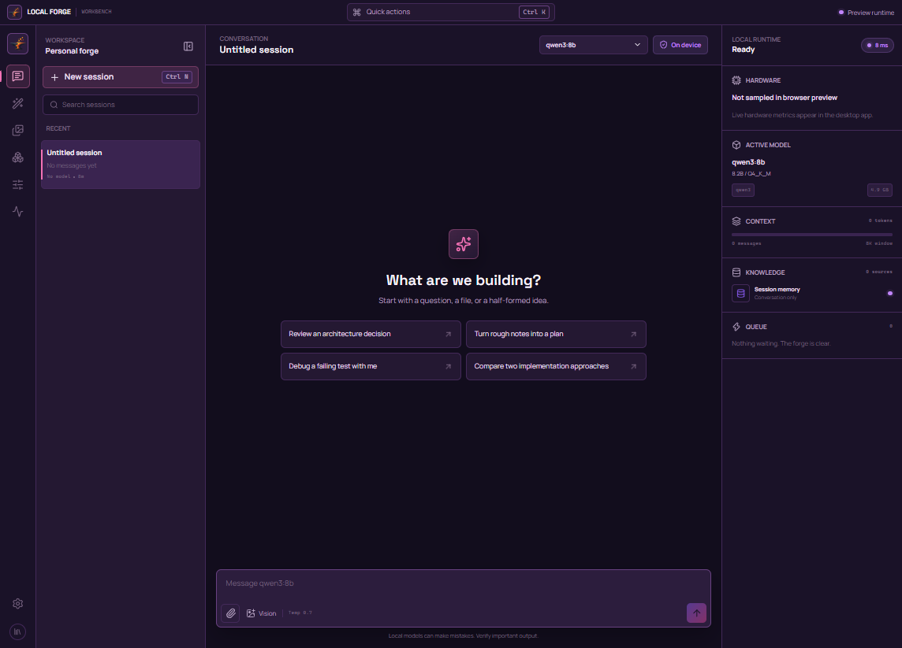
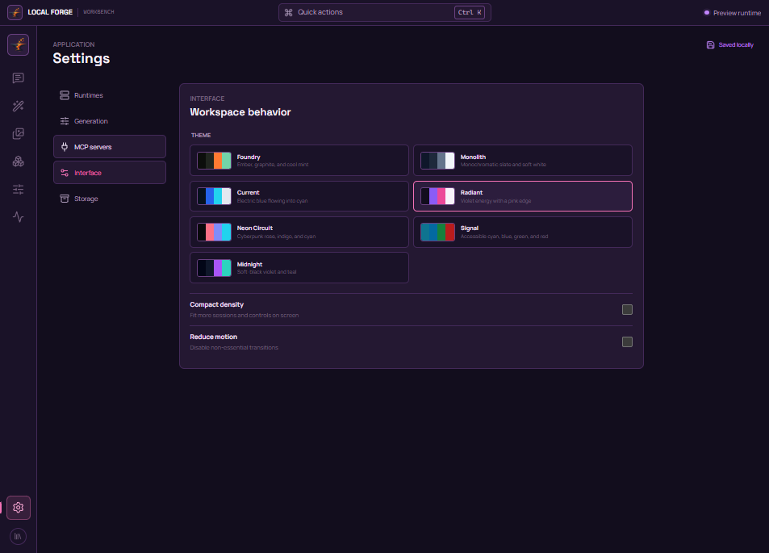
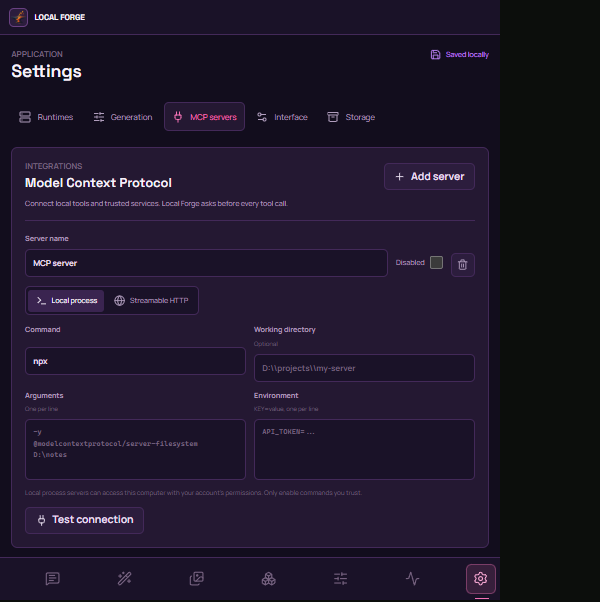
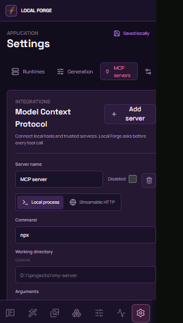

# Local Forge


Local Forge is a fast, local-first desktop workbench for open models. Chat with Ollama, generate images with local Diffusers models, train PEFT adapters, organize sessions, and inspect your machine. Data stays on your device unless you explicitly connect a remote MCP server.

> **Functional alpha:** local chat, MCP tools, image generation, QLoRA training, persistence, model management, hardware telemetry, and desktop packaging work. Image and training runtimes use your own Python environment and model files.

## Screenshots

### Workbench



### Themes



### MCP configuration





## Highlights

- Streamed Markdown chat with locally installed Ollama models
- Persistent sessions, image attachments, search, pinning, and deletion
- Local Diffusers and `.safetensors` / `.ckpt` model registration
- Cancellable image generation with live step progress and Library import
- Local image descriptions and generation prompts through Ollama vision models
- Optional Face Fix, tiled 2x/4x UltraSharp upscaling, and saved NSFW region masks
- Cancellable QLoRA training with live progress and standard PEFT output
- Screenshot and reference-image imports shared by Studio and Library
- Live RAM and NVIDIA telemetry, with unavailable data left unknown
- Stdio and Streamable HTTP MCP servers with per-call approval
- Seven persistent interface themes
- Sandboxed Electron renderer with a narrow typed preload API

## Run locally

Requirements: Node.js 22.12+, npm, and [Ollama](https://ollama.com/). Python is only required for Studio generation and Tune training.

```powershell
ollama serve
npm ci
npm run dev
```

Opening Vite directly uses a browser preview adapter. Use the Electron window for filesystem imports, MCP servers, encrypted credential persistence, and real hardware data.

See the [runtime and project guide](docs/RUNTIME_AND_PROJECT_GUIDE.md) for image and training setup, MCP servers, validation, releases, and project status. See the [contribution guide](CONTRIBUTING.md), [security policy](SECURITY.md), [asset notes](docs/THIRD_PARTY_ASSETS.md), and [MIT License](LICENSE) for repository policies and project details.
